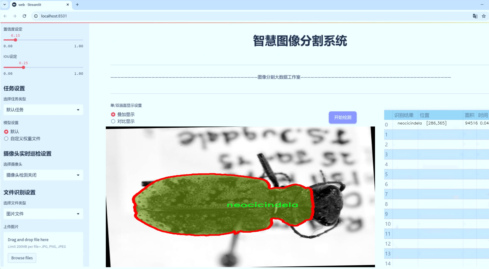
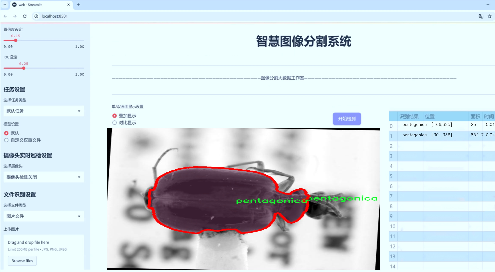
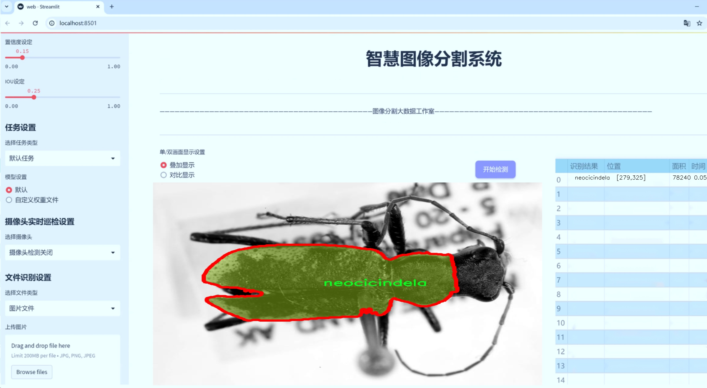
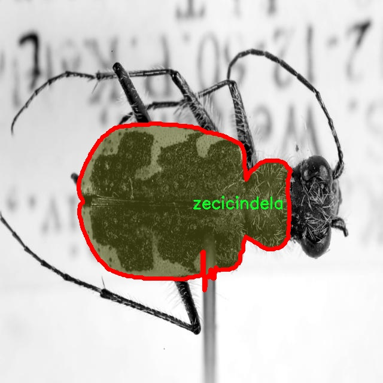
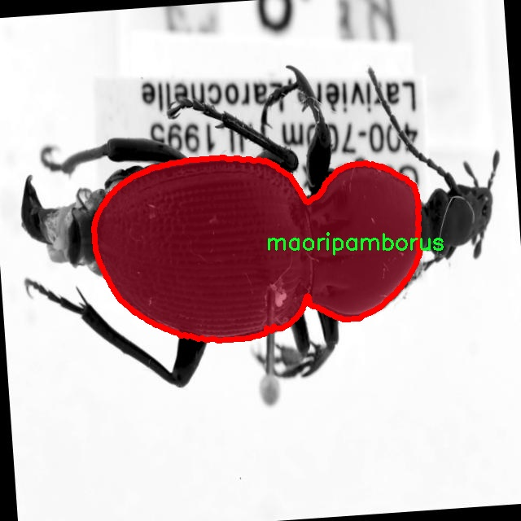
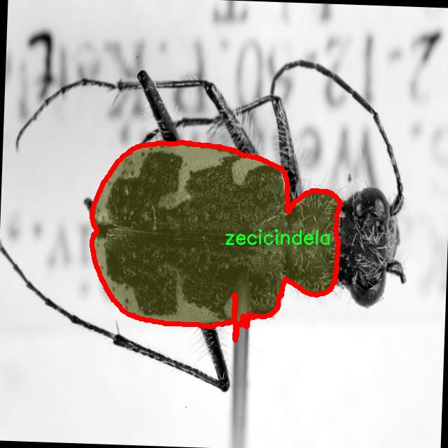
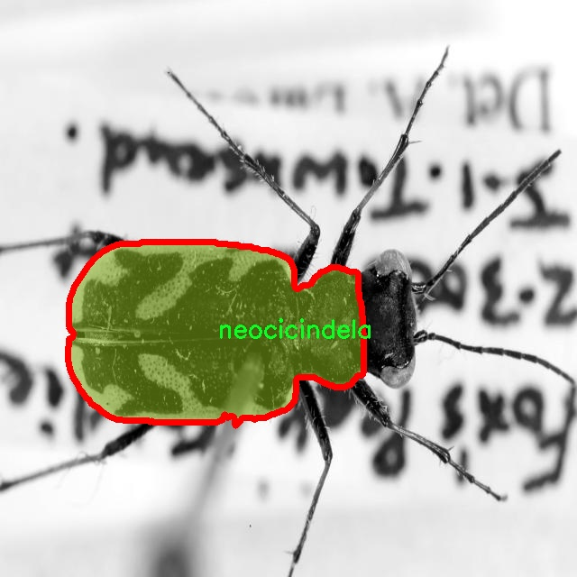
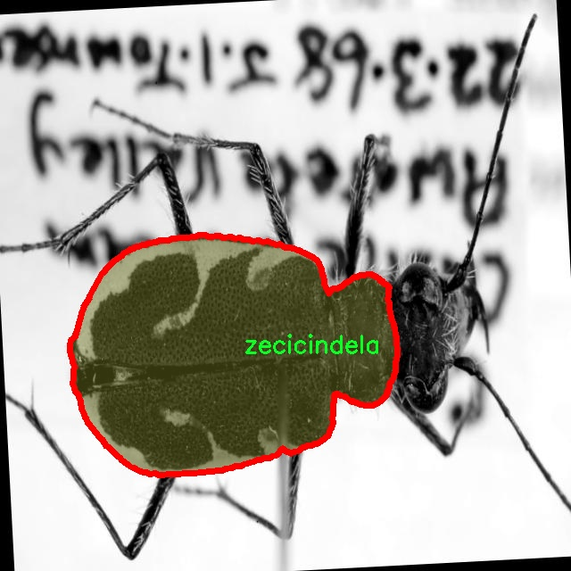

# 甲虫身体图像分割系统源码＆数据集分享
 [yolov8-seg-EfficientRepBiPAN＆yolov8-seg-C2f-FocusedLinearAttention等50+全套改进创新点发刊_一键训练教程_Web前端展示]

### 1.研究背景与意义

项目参考[ILSVRC ImageNet Large Scale Visual Recognition Challenge](https://gitee.com/YOLOv8_YOLOv11_Segmentation_Studio/projects)

项目来源[AAAI Global Al lnnovation Contest](https://kdocs.cn/l/cszuIiCKVNis)

研究背景与意义

随着计算机视觉技术的迅猛发展，物体检测与图像分割已成为人工智能领域的重要研究方向。尤其是在生物多样性保护和生态研究中，利用深度学习算法对生物体进行精确识别和分割，能够为科学家提供更为准确的数据支持，从而促进对生态系统的理解与保护。甲虫作为地球上最为丰富的昆虫类群之一，其种类繁多、形态各异，扮演着重要的生态角色。对甲虫的研究不仅有助于揭示其生态功能，还能为生物多样性保护提供重要依据。因此，开发一个高效的甲虫身体图像分割系统，能够有效提升甲虫种类的识别精度与效率，具有重要的科学价值和应用前景。

本研究基于改进的YOLOv8模型，构建一个专门针对甲虫身体图像的分割系统。YOLO（You Only Look Once）系列模型以其高效的实时检测能力和较高的准确率在图像处理领域得到了广泛应用。通过对YOLOv8的改进，我们旨在提升其在细粒度图像分割任务中的表现，尤其是在处理多类别、多样本的甲虫图像时，能够实现更为精准的分割效果。该系统将使用包含1800张图像和88个类别的甲虫数据集，涵盖了从Amarophilus到Zeopoecilus等多种甲虫类群，确保了数据的多样性和代表性。

在实际应用中，甲虫图像分割系统不仅可以为生态学研究提供强有力的工具，还能够在农业、林业等领域发挥重要作用。例如，通过对害虫甲虫的实时监测与识别，农民可以及时采取防治措施，从而减少农作物的损失。此外，该系统还可以为生物分类学、生态监测等领域提供数据支持，帮助研究人员更好地理解甲虫的分布与生态习性。

总之，基于改进YOLOv8的甲虫身体图像分割系统的研究，不仅具有重要的理论意义，也具备广泛的实际应用价值。通过对甲虫图像的高效分割与识别，我们能够为生物多样性保护提供新的思路与方法，推动生态学研究的深入发展。同时，该系统的成功实施也将为其他生物体的图像处理与分析提供借鉴，促进计算机视觉技术在生物科学领域的进一步应用与发展。

### 2.图片演示







##### 注意：由于此博客编辑较早，上面“2.图片演示”和“3.视频演示”展示的系统图片或者视频可能为老版本，新版本在老版本的基础上升级如下：（实际效果以升级的新版本为准）

  （1）适配了YOLOV8的“目标检测”模型和“实例分割”模型，通过加载相应的权重（.pt）文件即可自适应加载模型。

  （2）支持“图片识别”、“视频识别”、“摄像头实时识别”三种识别模式。

  （3）支持“图片识别”、“视频识别”、“摄像头实时识别”三种识别结果保存导出，解决手动导出（容易卡顿出现爆内存）存在的问题，识别完自动保存结果并导出到tempDir中。

  （4）支持Web前端系统中的标题、背景图等自定义修改，后面提供修改教程。

  另外本项目提供训练的数据集和训练教程,暂不提供权重文件（best.pt）,需要您按照教程进行训练后实现图片演示和Web前端界面演示的效果。

### 3.视频演示

[3.1 视频演示](https://www.bilibili.com/video/BV1Mr2nYbEEq/)

### 4.数据集信息展示

##### 4.1 本项目数据集详细数据（类别数＆类别名）

nc: 18
names: ['allocinopus', 'amarotypus', 'bembidion', 'clivina', 'ctenognathus', 'demetrida', 'dicrochile', 'kenodactylus', 'loxomerus', 'maoripamborus', 'meclothrax', 'mecodema', 'neocicindela', 'pentagonica', 'perigona', 'plocamostethus', 'synteratus', 'zecicindela']


##### 4.2 本项目数据集信息介绍

数据集信息展示

在本研究中，我们使用了名为“ground beetles”的数据集，以改进YOLOv8-seg的甲虫身体图像分割系统。该数据集专注于地面甲虫的多样性，包含18个不同的类别，涵盖了丰富的生态特征和形态特征。这些类别包括allocinopus、amarotypus、bembidion、clivina、ctenognathus、demetrida、dicrochile、kenodactylus、loxomerus、maoripamborus、meclothrax、mecodema、neocicindela、pentagonica、perigona、plocamostethus、synteratus和zecicindela。每个类别都代表了一种独特的甲虫，展示了其在自然界中的多样性与复杂性。

数据集的构建过程严格遵循科学标准，确保每个类别的样本数量充足且具有代表性。这些图像不仅包括甲虫的正面视图，还涵盖了侧面、背面和不同环境下的生境，旨在为模型提供多样化的训练数据。这种多样性对于提高模型的泛化能力至关重要，尤其是在处理不同光照、背景和角度时，能够有效减少过拟合现象。

在数据集的标注过程中，采用了高精度的图像分割技术，确保每个甲虫的轮廓都被准确地标记。这一过程不仅提高了数据集的质量，也为后续的模型训练提供了坚实的基础。通过对甲虫身体的精确分割，YOLOv8-seg能够更好地理解和识别不同类别之间的细微差别，从而提升分割的准确性和效率。

此外，数据集还考虑到了甲虫在不同生态环境中的分布情况，包含了森林、草原、湿地等多种栖息地的图像。这种生态背景的多样性不仅有助于模型学习到不同环境对甲虫形态的影响，也为生态学研究提供了重要的数据支持。通过分析甲虫在不同环境中的表现，研究人员可以深入理解其生态适应性和生物多样性。

在训练过程中，我们将采用数据增强技术，以进一步提升模型的鲁棒性。通过旋转、缩放、裁剪和颜色变换等方法，模拟出更多的训练样本，从而使模型在面对未知数据时，能够保持较高的识别率。这种策略在处理复杂的图像分割任务时尤为重要，能够有效提升模型的性能。

总之，“ground beetles”数据集为改进YOLOv8-seg的甲虫身体图像分割系统提供了丰富而多样的训练数据。通过对18个类别的深入研究和分析，我们期望能够实现更高效、更准确的甲虫图像分割，推动相关领域的研究进展。数据集的构建和应用不仅为机器学习模型的训练提供了基础，也为生态学和生物多样性保护提供了重要的数据支持，展现了计算机视觉技术在生物研究中的广泛应用潜力。











### 5.全套项目环境部署视频教程（零基础手把手教学）

[5.1 环境部署教程链接（零基础手把手教学）](https://www.bilibili.com/video/BV1jG4Ve4E9t/?vd_source=bc9aec86d164b67a7004b996143742dc)


[5.2 安装Python虚拟环境创建和依赖库安装视频教程链接（零基础手把手教学）](https://www.bilibili.com/video/BV1nA4VeYEze/?vd_source=bc9aec86d164b67a7004b996143742dc)

### 6.手把手YOLOV8-seg训练视频教程（零基础小白有手就能学会）

[6.1 手把手YOLOV8-seg训练视频教程（零基础小白有手就能学会）](https://www.bilibili.com/video/BV1cA4VeYETe/?vd_source=bc9aec86d164b67a7004b996143742dc)


按照上面的训练视频教程链接加载项目提供的数据集，运行train.py即可开始训练



     Epoch   gpu_mem       box       obj       cls    labels  img_size
     1/200     0G   0.01576   0.01955  0.007536        22      1280: 100%|██████████| 849/849 [14:42<00:00,  1.04s/it]
               Class     Images     Labels          P          R     mAP@.5 mAP@.5:.95: 100%|██████████| 213/213 [01:14<00:00,  2.87it/s]
                 all       3395      17314      0.994      0.957      0.0957      0.0843

     Epoch   gpu_mem       box       obj       cls    labels  img_size
     2/200     0G   0.01578   0.01923  0.007006        22      1280: 100%|██████████| 849/849 [14:44<00:00,  1.04s/it]
               Class     Images     Labels          P          R     mAP@.5 mAP@.5:.95: 100%|██████████| 213/213 [01:12<00:00,  2.95it/s]
                 all       3395      17314      0.996      0.956      0.0957      0.0845

     Epoch   gpu_mem       box       obj       cls    labels  img_size
     3/200     0G   0.01561    0.0191  0.006895        27      1280: 100%|██████████| 849/849 [10:56<00:00,  1.29it/s]
               Class     Images     Labels          P          R     mAP@.5 mAP@.5:.95: 100%|███████   | 187/213 [00:52<00:00,  4.04it/s]
                 all       3395      17314      0.996      0.957      0.0957      0.0845


### 7.50+种全套YOLOV8-seg创新点代码加载调参视频教程（一键加载写好的改进模型的配置文件）

[7.1 50+种全套YOLOV8-seg创新点代码加载调参视频教程（一键加载写好的改进模型的配置文件）](https://www.bilibili.com/video/BV1Hw4VePEXv/?vd_source=bc9aec86d164b67a7004b996143742dc)

### 8.YOLOV8-seg图像分割算法原理

原始YOLOv8-seg算法原理

YOLOv8-seg算法是2023年1月推出的YOLO系列中的最新版本，代表了计算机视觉领域在目标检测与实例分割任务中的一项重大进步。作为YOLO系列的继承者，YOLOv8不仅在性能上超越了前辈，还在算法结构和实现方式上进行了深刻的创新。该算法的设计旨在兼顾高精度与高效率，能够在多种硬件平台上灵活运行，从而适应广泛的应用场景。

YOLOv8-seg的核心在于其独特的网络架构。该算法的主干网络采用了跨阶段部分（CSP）结构，这一设计理念旨在通过引入多层次的特征提取机制，增强网络对图像中不同尺度和复杂特征的感知能力。与YOLOv5相比，YOLOv8在模块设计上进行了优化，尤其是将C3模块替换为更轻量的C2f模块，显著提高了计算效率和特征提取的灵活性。此外，YOLOv8还保留了空间金字塔池化（SPPF）模块，这一模块通过多尺度特征融合，进一步提升了网络对目标的检测能力。

在YOLOv8-seg中，输入端的图像经过了一系列预处理步骤，包括Mosaic数据增强、自适应图像缩放和灰度填充等，这些步骤旨在提升模型的鲁棒性和泛化能力。经过预处理的图像被送入主干网络，网络通过卷积和池化操作提取图像特征。在这一过程中，YOLOv8-seg通过引入更多的跳层连接和Split操作，增强了特征的传递效率，使得网络能够更好地捕捉到细节信息。

YOLOv8-seg的Neck部分采用了路径聚合网络（PAN）结构，通过上下采样和特征拼接的方式，将不同尺度的特征图进行融合。这一设计使得网络能够在多尺度下进行目标检测与分割，尤其是在处理小目标时，能够有效提升检测精度。值得注意的是，YOLOv8-seg引入了新的解耦头（decoupled head），这一结构的创新在于将分类和回归过程分开处理，避免了传统方法中耦合带来的信息干扰，从而提高了模型的整体性能。

在损失函数的设计上，YOLOv8-seg采用了新的损失策略，结合了变焦损失和数据平均保真度损失等多种损失计算方式，以更精确地评估模型的输出。这种策略使得YOLOv8-seg在目标检测和实例分割任务中，能够更好地平衡分类损失与边界框损失，从而实现更高的检测精度。

YOLOv8-seg的创新还体现在其对小目标的检测能力上。通过调整网络结构和引入新的检测头，YOLOv8-seg能够在复杂背景下更好地识别和定位小目标。此外，YOLOv8-seg在设计时充分考虑了实时性，确保其在不同硬件平台上均能高效运行，满足实际应用中的实时性需求。

总的来说，YOLOv8-seg算法的原理在于通过优化网络结构、改进损失函数和引入解耦头等多种手段，提升了目标检测与实例分割的性能。其在精度和速度上的优势，使得YOLOv8-seg成为当前计算机视觉领域中最为先进的模型之一，适用于各种复杂的视觉任务。随着YOLOv8-seg的不断发展与应用，未来的计算机视觉技术将迎来更加广阔的前景。


### 9.系统功能展示（检测对象为举例，实际内容以本项目数据集为准）

图9.1.系统支持检测结果表格显示

  图9.2.系统支持置信度和IOU阈值手动调节

  图9.3.系统支持自定义加载权重文件best.pt(需要你通过步骤5中训练获得)

  图9.4.系统支持摄像头实时识别

  图9.5.系统支持图片识别

  图9.6.系统支持视频识别

  图9.7.系统支持识别结果文件自动保存

  图9.8.系统支持Excel导出检测结果数据


### 10.50+种全套YOLOV8-seg创新点原理讲解（非科班也可以轻松写刊发刊，V11版本正在科研待更新）

#### 10.1 由于篇幅限制，每个创新点的具体原理讲解就不一一展开，具体见下列网址中的创新点对应子项目的技术原理博客网址【Blog】：


[10.1 50+种全套YOLOV8-seg创新点原理讲解链接](https://gitee.com/qunmasj/good)

#### 10.2 部分改进模块原理讲解(完整的改进原理见上图和技术博客链接)【此小节的图要是加载失败请移步原始博客查看，链接：https://blog.csdn.net/cheng2333333?type=blog】

### YOLOv8简介
YOLOv8是一种目标检测模型，是基于YOLO (You Only Look Once)系列算法发展而来的最新版本。它的核心思想是将目标检测任务转化为一个回归问题，通过单次前向传播即可直接预测出图像中的多个目标的位置和类别。
YOLOv8的网络结构采用了Darknet作为其主干网络，主要由卷积层和池化层构成。与之前的版本相比，YOLOv8在网络结构上进行了改进，引入了更多的卷积层和残差模块，以提高模型的准确性和鲁棒性。
YOLOv8采用了一种特征金字塔网络(Feature Pyramid Network,FPN)的结构，通过在不同层级上融合多尺度的特征信息，可以对不同尺度的目标进行有效的检测。此外，YOLOv8还引入了一种自适应感知域(Adaptive Anchors
的机制，通过自适应地学习目标的尺度和
长宽比，提高了模型对于不同尺度和形状目标的检测效果。
总体来说，YOLOv8结构模型综合了多个先进的目标检测技术，在保证检测速度的同时提升了检测精度和鲁棒性，被广泛应用于实时目标检测任务中。


#### yolov8网络模型结构图

YOLOv8 (You Only Look Once version 8)是一种目标检测算法，它在实时场景下可以快速准确地检测图像中的目标。
YOLOv8的网络模型结构基于Darknet框架，由一系列卷积层、池化层和全连接层组成。主要包含以下几个组件:
1.输入层:接收输入图像。
2.卷积层:使用不同尺寸的卷积核来提取图像特征。
3.残差块(Residual blocks):通过使用跳跃连接(skip connections）来解决梯度消失问题，使得网络更容易训练。
4.上采样层(Upsample layers):通过插值操作将特征图的尺寸放大，以便在不同尺度上进行目标检测。
5.池化层:用于减小特征图的尺寸，同时保留重要的特征。
6.1x1卷积层:用于降低通道数，减少网络参数量。
7.3x3卷积层:用于进—步提取和组合特征。
8.全连接层:用于最后的目标分类和定位。
YOLOv8的网络结构采用了多个不同尺度的特征图来检测不同大小的目标，从而提高了目标检测的准确性和多尺度性能。
请注意，YOLOv8网络模型结构图的具体细节可能因YOLO版本和实现方式而有所不同。


#### yolov8模型结构
YOLOv8模型是一种目标检测模型，其结构是基于YOLOv3模型进行改进的。模型结构可以分为主干网络和检测头两个部分。
主干网络是一种由Darknet-53构成的卷积神经网络。Darknet-53是一个经过多层卷积和残差连接构建起来的深度神经网络。它能够提取图像的特征信息，并将这些信息传递给检测头。
检测头是YOLOv8的关键部分，它负责在图像中定位和识别目标。检测头由一系列卷积层和全连接层组成。在每个检测头中，会生成一组锚框，并针对每个锚框预测目标的类别和位置信息。
YOLOv8模型使用了预训练的权重，其中在COCO数据集上进行了训练。这意味着该模型已经通过大规模数据集的学习，具有一定的目标检测能力。

### RT-DETR骨干网络HGNetv2简介
#### RT-DETR横空出世
前几天被百度的RT-DETR刷屏，参考该博客提出的目标检测新范式对原始DETR的网络结构进行了调整和优化，以提高计算速度和减小模型大小。这包括使用更轻量级的基础网络和调整Transformer结构。并且，摒弃了nms处理的detr结构与传统的物体检测方法相比，不仅训练是端到端的，检测也能端到端，这意味着整个网络在训练过程中一起进行优化，推理过程不需要昂贵的后处理代价，这有助于提高模型的泛化能力和性能。


当然，人们对RT-DETR之所以产生浓厚的兴趣，我觉得大概率还是对YOLO系列审美疲劳了，就算是出到了YOLO10086，我还是只想用YOLOv5和YOLOv7的框架来魔改做业务。。

#### 初识HGNet
看到RT-DETR的性能指标，发现指标最好的两个模型backbone都是用的HGNetv2，毫无疑问，和当时的picodet一样，骨干都是使用百度自家的网络。初识HGNet的时候，当时是参加了第四届百度网盘图像处理大赛，文档图像方向识别专题赛道，简单来说，就是使用分类网络对一些文档截图或者图片进行方向角度分类。


当时的方案并没有那么快定型，通常是打榜过程发现哪个网络性能好就使用哪个网络做魔改，而且木有显卡，只能蹭Ai Studio的平台，不过v100一天8小时的实验时间有点短，这也注定了大模型用不了。 

流水的模型，铁打的炼丹人，最后发现HGNet-tiny各方面指标都很符合我们的预期，后面就一直围绕它魔改。当然，比赛打榜是目的，学习才是享受过程，当时看到效果还可以，便开始折腾起了HGNet的网络架构，我们可以看到，PP-HGNet 针对 GPU 设备，对目前 GPU 友好的网络做了分析和归纳，尽可能多的使用 3x3 标准卷积（计算密度最高），PP-HGNet是由多个HG-Block组成，细节如下：


ConvBNAct是啥？简单聊一聊，就是Conv+BN+Act，CV Man应该最熟悉不过了：
```python
class ConvBNAct(TheseusLayer):
    def __init__(self,
                 in_channels,
                 out_channels,
                 kernel_size,
                 stride,
                 groups=1,
                 use_act=True):
        super().__init__()
        self.use_act = use_act
        self.conv = Conv2D(
            in_channels,
            out_channels,
            kernel_size,
            stride,
            padding=(kernel_size - 1) // 2,
            groups=groups,
            bias_attr=False)
        self.bn = BatchNorm2D(
            out_channels,
            weight_attr=ParamAttr(regularizer=L2Decay(0.0)),
            bias_attr=ParamAttr(regularizer=L2Decay(0.0)))
        if self.use_act:
            self.act = ReLU()
 
    def forward(self, x):
        x = self.conv(x)
        x = self.bn(x)
        if self.use_act:
            x = self.act(x)
        return x 
```
且标准卷积的数量随层数深度增加而增多，从而得到一个有利于 GPU 推理的骨干网络，同样速度下，精度也超越其他 CNN ，性价比也优于ViT-base模型。


另外，我们可以看到：

PP-HGNet 的第一层由channel为96的Stem模块构成，目的是为了减少参数量和计算量。PP-HGNet

Tiny的整体结构由四个HG Stage构成，而每个HG Stage主要由包含大量标准卷积的HG Block构成。

PP-HGNet的第三到第五层使用了使用了可学习的下采样层（LDS Layer），该层group为输入通道数，可达到降参降计算量的作用，且Tiny模型仅包含三个LDS Layer，并不会对GPU的利用率造成较大影响.

PP-HGNet的激活函数为Relu，常数级操作可保证该模型在硬件上的推理速度。

### 11.项目核心源码讲解（再也不用担心看不懂代码逻辑）

#### 11.1 ultralytics\data\annotator.py

以下是对给定代码的核心部分进行提炼和详细注释的结果：

```python
# 导入必要的库
from pathlib import Path
from ultralytics import SAM, YOLO

def auto_annotate(data, det_model='yolov8x.pt', sam_model='sam_b.pt', device='', output_dir=None):
    """
    自动标注图像，使用YOLO目标检测模型和SAM分割模型。

    参数:
        data (str): 包含待标注图像的文件夹路径。
        det_model (str, optional): 预训练的YOLO检测模型，默认为'yolov8x.pt'。
        sam_model (str, optional): 预训练的SAM分割模型，默认为'sam_b.pt'。
        device (str, optional): 模型运行的设备，默认为空字符串（使用CPU或可用的GPU）。
        output_dir (str | None | optional): 保存标注结果的目录。
            默认为与'data'相同目录下的'labels'文件夹。

    示例:
        auto_annotate(data='ultralytics/assets', det_model='yolov8n.pt', sam_model='mobile_sam.pt')
    """
    # 加载YOLO检测模型和SAM分割模型
    det_model = YOLO(det_model)  # 初始化YOLO模型
    sam_model = SAM(sam_model)    # 初始化SAM模型

    # 将数据路径转换为Path对象
    data = Path(data)
    
    # 如果未指定输出目录，则创建一个默认的输出目录
    if not output_dir:
        output_dir = data.parent / f'{data.stem}_auto_annotate_labels'
    Path(output_dir).mkdir(exist_ok=True, parents=True)  # 创建输出目录

    # 使用YOLO模型进行目标检测
    det_results = det_model(data, stream=True, device=device)

    # 遍历检测结果
    for result in det_results:
        class_ids = result.boxes.cls.int().tolist()  # 获取检测到的类别ID
        if len(class_ids):  # 如果检测到目标
            boxes = result.boxes.xyxy  # 获取边界框坐标
            # 使用SAM模型进行分割，传入边界框
            sam_results = sam_model(result.orig_img, bboxes=boxes, verbose=False, save=False, device=device)
            segments = sam_results[0].masks.xyn  # 获取分割结果

            # 将分割结果写入文本文件
            with open(f'{str(Path(output_dir) / Path(result.path).stem)}.txt', 'w') as f:
                for i in range(len(segments)):
                    s = segments[i]
                    if len(s) == 0:  # 如果没有分割结果，则跳过
                        continue
                    segment = map(str, segments[i].reshape(-1).tolist())  # 将分割结果转换为字符串
                    f.write(f'{class_ids[i]} ' + ' '.join(segment) + '\n')  # 写入类别ID和分割结果
```

### 代码核心部分分析：
1. **模型加载**：通过`YOLO`和`SAM`类加载预训练的目标检测和分割模型。
2. **输出目录创建**：根据输入数据路径自动创建输出目录，确保结果能够被保存。
3. **目标检测**：使用YOLO模型对输入数据进行目标检测，返回检测结果。
4. **分割处理**：对于每个检测到的目标，使用SAM模型进行分割，获取分割掩码。
5. **结果保存**：将每个目标的类别ID和对应的分割结果保存到文本文件中，便于后续使用。

通过这些核心步骤，代码实现了自动标注图像的功能，结合了目标检测和图像分割技术。

这个文件是Ultralytics YOLO项目中的一个模块，主要用于自动标注图像。它通过结合YOLO目标检测模型和SAM分割模型，能够对给定的图像进行自动化的标注处理。

在文件的开头，首先导入了必要的库，包括`Path`类用于路径操作，以及`SAM`和`YOLO`类用于加载相应的模型。接下来定义了一个名为`auto_annotate`的函数，该函数接受多个参数：

- `data`：指定要进行标注的图像文件夹路径。
- `det_model`：可选参数，指定使用的YOLO检测模型，默认值为'yolov8x.pt'。
- `sam_model`：可选参数，指定使用的SAM分割模型，默认值为'sam_b.pt'。
- `device`：可选参数，指定模型运行的设备，可以是CPU或GPU，默认为空字符串。
- `output_dir`：可选参数，指定保存标注结果的目录，默认会在`data`的同一目录下创建一个名为'labels'的文件夹。

函数的实现步骤如下：

1. 首先，加载YOLO和SAM模型。
2. 将输入的`data`路径转换为`Path`对象，以便于后续的路径操作。
3. 如果没有指定输出目录，则创建一个新的目录，命名为`{data.stem}_auto_annotate_labels`，其中`data.stem`是`data`路径的基本名称。
4. 使用YOLO模型对输入的图像进行目标检测，结果以流的方式返回。
5. 对于每个检测结果，提取出分类ID和边界框（bounding boxes）。
6. 如果检测到的类别ID不为空，则调用SAM模型进行分割，传入原始图像和检测到的边界框。
7. 获取分割结果中的掩码（masks），并将每个分割结果写入到一个文本文件中，文件名与原始图像相同，后缀为`.txt`。

在文本文件中，每一行包含一个分类ID和对应的分割坐标，坐标经过展平处理并转换为字符串格式。

总的来说，这个模块通过自动化的方式，结合目标检测和图像分割技术，极大地简化了图像标注的过程，适用于需要快速处理大量图像的场景。

#### 11.2 ui.py

以下是代码中最核心的部分，并附上详细的中文注释：

```python
import sys
import subprocess

def run_script(script_path):
    """
    使用当前 Python 环境运行指定的脚本。

    Args:
        script_path (str): 要运行的脚本路径

    Returns:
        None
    """
    # 获取当前 Python 解释器的路径
    python_path = sys.executable

    # 构建运行命令，使用 streamlit 运行指定的脚本
    command = f'"{python_path}" -m streamlit run "{script_path}"'

    # 执行命令
    result = subprocess.run(command, shell=True)
    # 检查命令执行的返回码，如果不为0，表示执行出错
    if result.returncode != 0:
        print("脚本运行出错。")

# 实例化并运行应用
if __name__ == "__main__":
    # 指定要运行的脚本路径
    script_path = "web.py"  # 这里可以替换为实际的脚本路径

    # 调用函数运行脚本
    run_script(script_path)
```

### 代码说明：
1. **导入模块**：
   - `sys`：用于获取当前 Python 解释器的路径。
   - `subprocess`：用于执行外部命令。

2. **定义 `run_script` 函数**：
   - 该函数接受一个参数 `script_path`，表示要运行的 Python 脚本的路径。
   - 使用 `sys.executable` 获取当前 Python 解释器的路径。
   - 构建一个命令字符串，使用 `streamlit` 模块运行指定的脚本。
   - 使用 `subprocess.run` 执行构建的命令，并通过 `shell=True` 允许在 shell 中执行。
   - 检查命令的返回码，如果返回码不为0，表示脚本运行出错，打印错误信息。

3. **主程序入口**：
   - 使用 `if __name__ == "__main__":` 确保该部分代码仅在直接运行脚本时执行。
   - 指定要运行的脚本路径（这里为 `web.py`）。
   - 调用 `run_script` 函数来执行指定的脚本。

这个程序文件的主要功能是通过当前的 Python 环境来运行一个指定的脚本，具体是一个名为 `web.py` 的文件。程序首先导入了必要的模块，包括 `sys`、`os` 和 `subprocess`，以及一个自定义的 `abs_path` 函数，用于获取脚本的绝对路径。

在 `run_script` 函数中，首先获取当前 Python 解释器的路径，这通过 `sys.executable` 实现。接着，构建一个命令字符串，该命令使用 `streamlit` 模块来运行指定的脚本。这里的命令格式为 `"{python_path}" -m streamlit run "{script_path}"`，其中 `python_path` 是当前 Python 解释器的路径，`script_path` 是要运行的脚本的路径。

然后，使用 `subprocess.run` 方法执行这个命令。该方法的 `shell=True` 参数允许在 shell 中执行命令。执行后，程序检查返回码，如果返回码不为零，表示脚本运行出错，程序会打印出相应的错误信息。

在文件的最后部分，使用 `if __name__ == "__main__":` 语句来确保只有在直接运行该文件时才会执行下面的代码。在这里，指定了要运行的脚本路径 `web.py`，并调用 `run_script` 函数来执行该脚本。

总体来说，这个程序的目的是为了方便地在当前 Python 环境中运行一个 Streamlit 应用脚本，并处理可能出现的错误。

#### 11.3 ultralytics\utils\triton.py

以下是代码中最核心的部分，并附上详细的中文注释：

```python
from typing import List
from urllib.parse import urlsplit
import numpy as np

class TritonRemoteModel:
    """
    与远程Triton推理服务器模型交互的客户端。

    属性:
        endpoint (str): Triton服务器上模型的名称。
        url (str): Triton服务器的URL。
        triton_client: Triton客户端（HTTP或gRPC）。
        InferInput: Triton客户端的输入类。
        InferRequestedOutput: Triton客户端的输出请求类。
        input_formats (List[str]): 模型输入的数据类型。
        np_input_formats (List[type]): 模型输入的numpy数据类型。
        input_names (List[str]): 模型输入的名称。
        output_names (List[str]): 模型输出的名称。
    """

    def __init__(self, url: str, endpoint: str = '', scheme: str = ''):
        """
        初始化TritonRemoteModel。

        参数可以单独提供或从一个集体的'url'参数解析，格式为
            <scheme>://<netloc>/<endpoint>/<task_name>

        参数:
            url (str): Triton服务器的URL。
            endpoint (str): Triton服务器上模型的名称。
            scheme (str): 通信方案（'http'或'gRPC'）。
        """
        # 如果没有提供endpoint和scheme，则从URL字符串解析所有参数
        if not endpoint and not scheme:
            splits = urlsplit(url)  # 解析URL
            endpoint = splits.path.strip('/').split('/')[0]  # 获取模型名称
            scheme = splits.scheme  # 获取通信方案
            url = splits.netloc  # 获取网络位置

        self.endpoint = endpoint  # 设置模型名称
        self.url = url  # 设置服务器URL

        # 根据通信方案选择Triton客户端
        if scheme == 'http':
            import tritonclient.http as client  # 导入HTTP客户端
            self.triton_client = client.InferenceServerClient(url=self.url, verbose=False, ssl=False)
            config = self.triton_client.get_model_config(endpoint)  # 获取模型配置
        else:
            import tritonclient.grpc as client  # 导入gRPC客户端
            self.triton_client = client.InferenceServerClient(url=self.url, verbose=False, ssl=False)
            config = self.triton_client.get_model_config(endpoint, as_json=True)['config']  # 获取模型配置

        # 按字母顺序排序输出名称，例如'output0', 'output1'等
        config['output'] = sorted(config['output'], key=lambda x: x.get('name'))

        # 定义模型属性
        type_map = {'TYPE_FP32': np.float32, 'TYPE_FP16': np.float16, 'TYPE_UINT8': np.uint8}  # 数据类型映射
        self.InferRequestedOutput = client.InferRequestedOutput  # 设置输出请求类
        self.InferInput = client.InferInput  # 设置输入类
        self.input_formats = [x['data_type'] for x in config['input']]  # 获取输入数据类型
        self.np_input_formats = [type_map[x] for x in self.input_formats]  # 获取numpy数据类型
        self.input_names = [x['name'] for x in config['input']]  # 获取输入名称
        self.output_names = [x['name'] for x in config['output']]  # 获取输出名称

    def __call__(self, *inputs: np.ndarray) -> List[np.ndarray]:
        """
        使用给定的输入调用模型。

        参数:
            *inputs (List[np.ndarray]): 模型的输入数据。

        返回:
            List[np.ndarray]: 模型输出。
        """
        infer_inputs = []  # 存储输入数据的列表
        input_format = inputs[0].dtype  # 获取输入数据的格式
        for i, x in enumerate(inputs):
            # 如果输入数据类型与预期不符，则转换数据类型
            if x.dtype != self.np_input_formats[i]:
                x = x.astype(self.np_input_formats[i])
            # 创建InferInput对象并设置数据
            infer_input = self.InferInput(self.input_names[i], [*x.shape], self.input_formats[i].replace('TYPE_', ''))
            infer_input.set_data_from_numpy(x)  # 从numpy数组设置数据
            infer_inputs.append(infer_input)  # 添加到输入列表

        # 创建输出请求对象
        infer_outputs = [self.InferRequestedOutput(output_name) for output_name in self.output_names]
        # 调用Triton客户端进行推理
        outputs = self.triton_client.infer(model_name=self.endpoint, inputs=infer_inputs, outputs=infer_outputs)

        # 返回输出数据，转换为原始输入格式
        return [outputs.as_numpy(output_name).astype(input_format) for output_name in self.output_names]
```

### 代码核心部分说明：
1. **类定义和初始化**：`TritonRemoteModel`类用于与Triton推理服务器交互。初始化时解析URL并设置模型名称和服务器地址，选择合适的客户端（HTTP或gRPC），并获取模型配置。

2. **输入输出处理**：`__call__`方法允许用户通过调用实例来传递输入数据。它会根据模型配置创建输入对象，进行数据类型转换，并调用Triton客户端进行推理，最后返回输出结果。

这个程序文件是一个用于与远程Triton推理服务器模型交互的客户端类，名为`TritonRemoteModel`。该类的主要功能是通过HTTP或gRPC协议与Triton服务器进行通信，发送输入数据并接收模型的输出结果。

在类的初始化方法`__init__`中，用户可以通过URL、模型名称和通信协议来设置连接参数。如果用户没有提供模型名称和协议，程序会从URL中解析这些信息。接着，根据指定的通信协议，程序会导入相应的Triton客户端库，并创建一个与Triton服务器的连接。然后，它会获取指定模型的配置，包括输入和输出的名称及数据类型，并将输出名称按字母顺序排序。

类中定义了一些属性，例如`input_formats`和`np_input_formats`，分别用于存储模型输入的数据类型和对应的NumPy数据类型。这些信息对于后续的数据处理和转换非常重要。

类的`__call__`方法允许用户以函数的方式调用模型。用户可以传入一个或多个NumPy数组作为输入。该方法会检查输入数据的类型，并根据模型要求进行必要的类型转换。然后，它会创建输入对象并将数据设置到这些对象中。接下来，程序会构建输出请求并调用Triton客户端的推理方法，最终返回模型的输出结果，输出数据会被转换回原始的NumPy数据类型。

总体来说，这个类提供了一个简洁的接口，使得用户能够方便地与Triton推理服务器进行交互，进行模型推理并获取结果。

#### 11.4 train.py

以下是经过简化并添加详细中文注释的核心代码部分：

```python
import os
import torch
import yaml
from ultralytics import YOLO  # 导入YOLO模型库

if __name__ == '__main__':  # 确保该模块被直接运行时才执行以下代码
    # 设置训练参数
    workers = 1  # 数据加载的工作进程数
    batch = 8  # 每个批次的样本数量
    device = "0" if torch.cuda.is_available() else "cpu"  # 判断是否使用GPU

    # 获取数据集配置文件的绝对路径
    data_path = abs_path(f'datasets/data/data.yaml', path_type='current')

    # 读取YAML文件，保持原有顺序
    with open(data_path, 'r') as file:
        data = yaml.load(file, Loader=yaml.FullLoader)

    # 修改数据集路径
    if 'train' in data and 'val' in data and 'test' in data:
        directory_path = os.path.dirname(data_path.replace(os.sep, '/'))  # 获取目录路径
        data['train'] = directory_path + '/train'  # 更新训练集路径
        data['val'] = directory_path + '/val'      # 更新验证集路径
        data['test'] = directory_path + '/test'    # 更新测试集路径

        # 将修改后的数据写回YAML文件
        with open(data_path, 'w') as file:
            yaml.safe_dump(data, file, sort_keys=False)

    # 加载YOLO模型配置文件和预训练权重
    model = YOLO(r"C:\codeseg\codenew\50+种YOLOv8算法改进源码大全和调试加载训练教程（非必要）\改进YOLOv8模型配置文件\yolov8-seg-C2f-Faster.yaml").load("./weights/yolov8s-seg.pt")

    # 开始训练模型
    results = model.train(
        data=data_path,  # 指定训练数据的配置文件路径
        device=device,    # 指定使用的设备（GPU或CPU）
        workers=workers,  # 指定使用的工作进程数
        imgsz=640,        # 指定输入图像的大小为640x640
        epochs=100,       # 指定训练的轮数为100
        batch=batch,      # 指定每个批次的样本数量
    )
```

### 代码说明：
1. **导入必要的库**：导入了处理文件路径、深度学习框架、YAML文件解析和YOLO模型的库。
2. **设置训练参数**：定义了数据加载的工作进程数、批次大小和设备选择（GPU或CPU）。
3. **读取和修改数据集配置**：从YAML文件中读取数据集路径，并根据当前文件目录更新训练、验证和测试集的路径。
4. **加载YOLO模型**：根据指定的配置文件和预训练权重加载YOLO模型。
5. **训练模型**：调用模型的训练方法，传入数据路径、设备、工作进程数、图像大小、训练轮数和批次大小等参数，开始训练过程。

该程序文件`train.py`主要用于训练YOLO（You Only Look Once）模型，具体是YOLOv8的一个变种，进行目标检测或分割任务。程序的结构相对简单，首先导入了一些必要的库，包括操作系统库`os`、深度学习框架`torch`、YAML文件处理库`yaml`以及YOLO模型的实现库`ultralytics`。此外，还设置了Matplotlib的后端为'TkAgg'，以便于图形显示。

在`__main__`模块中，程序首先设置了一些训练参数，包括工作进程数`workers`、批次大小`batch`、以及设备类型`device`。设备类型会根据当前系统是否支持CUDA来决定，如果支持则使用GPU（设备"0"），否则使用CPU。

接下来，程序通过`abs_path`函数获取数据集配置文件`data.yaml`的绝对路径，并将其转换为Unix风格的路径，以便后续处理。程序读取YAML文件中的内容，并检查是否包含'train'、'val'和'test'字段。如果这些字段存在，程序会将它们的路径修改为相对于当前目录的路径，并将修改后的内容写回到YAML文件中。

在模型加载部分，程序通过指定的配置文件路径加载YOLO模型。需要注意的是，不同的YOLO模型对设备的要求不同，如果出现内存不足的错误，可以尝试更换其他模型进行测试。

最后，程序调用`model.train()`方法开始训练模型，传入的数据配置文件路径、设备、工作进程数、输入图像大小、训练轮数（epochs）和批次大小等参数。训练过程会在指定的设备上进行，并根据设定的参数进行相应的训练。

总体来说，该程序实现了YOLOv8模型的训练流程，包括数据准备、模型加载和训练参数设置，适合用于目标检测或分割任务的模型训练。

#### 11.5 ultralytics\utils\dist.py

以下是代码中最核心的部分，并附上详细的中文注释：

```python
import os
import re
import shutil
import socket
import sys
import tempfile
from pathlib import Path

def find_free_network_port() -> int:
    """
    查找本地主机上可用的端口。

    在单节点训练时，如果不想连接到真实的主节点，但需要设置
    `MASTER_PORT` 环境变量时，这个函数非常有用。
    """
    with socket.socket(socket.AF_INET, socket.SOCK_STREAM) as s:
        s.bind(('127.0.0.1', 0))  # 绑定到本地地址和随机端口
        return s.getsockname()[1]  # 返回分配的端口号


def generate_ddp_file(trainer):
    """生成 DDP 文件并返回其文件名。"""
    # 获取训练器的模块和类名
    module, name = f'{trainer.__class__.__module__}.{trainer.__class__.__name__}'.rsplit('.', 1)

    # 构建 DDP 文件的内容
    content = f'''overrides = {vars(trainer.args)} \nif __name__ == "__main__":
    from {module} import {name}
    from ultralytics.utils import DEFAULT_CFG_DICT

    cfg = DEFAULT_CFG_DICT.copy()
    cfg.update(save_dir='')   # 处理额外的键 'save_dir'
    trainer = {name}(cfg=cfg, overrides=overrides)
    trainer.train()'''
    
    # 创建 DDP 目录（如果不存在）
    (USER_CONFIG_DIR / 'DDP').mkdir(exist_ok=True)
    
    # 创建临时文件并写入内容
    with tempfile.NamedTemporaryFile(prefix='_temp_',
                                     suffix=f'{id(trainer)}.py',
                                     mode='w+',
                                     encoding='utf-8',
                                     dir=USER_CONFIG_DIR / 'DDP',
                                     delete=False) as file:
        file.write(content)  # 写入生成的内容
    return file.name  # 返回临时文件的名称


def generate_ddp_command(world_size, trainer):
    """生成并返回分布式训练的命令。"""
    import __main__  # 本地导入以避免潜在问题
    if not trainer.resume:
        shutil.rmtree(trainer.save_dir)  # 如果不恢复训练，删除保存目录
    
    file = str(Path(sys.argv[0]).resolve())  # 获取当前脚本的绝对路径
    safe_pattern = re.compile(r'^[a-zA-Z0-9_. /\\-]{1,128}$')  # 允许的字符和最大长度
    # 检查文件名是否安全且存在，并且以 .py 结尾
    if not (safe_pattern.match(file) and Path(file).exists() and file.endswith('.py')):
        file = generate_ddp_file(trainer)  # 生成 DDP 文件
    
    dist_cmd = 'torch.distributed.run' if TORCH_1_9 else 'torch.distributed.launch'  # 根据 PyTorch 版本选择命令
    port = find_free_network_port()  # 查找可用端口
    # 构建命令列表
    cmd = [sys.executable, '-m', dist_cmd, '--nproc_per_node', f'{world_size}', '--master_port', f'{port}', file]
    return cmd, file  # 返回命令和文件名


def ddp_cleanup(trainer, file):
    """如果创建了临时文件，则删除它。"""
    if f'{id(trainer)}.py' in file:  # 检查文件名是否包含临时文件的后缀
        os.remove(file)  # 删除临时文件
```

### 代码核心功能说明：
1. **查找可用端口**：`find_free_network_port` 函数用于查找本地可用的网络端口，方便在分布式训练中设置 `MASTER_PORT` 环境变量。
2. **生成 DDP 文件**：`generate_ddp_file` 函数根据训练器的配置生成一个临时的 DDP 文件，方便后续的分布式训练。
3. **生成分布式训练命令**：`generate_ddp_command` 函数构建并返回用于启动分布式训练的命令，包括进程数和端口设置。
4. **清理临时文件**：`ddp_cleanup` 函数用于在训练结束后删除生成的临时文件，保持文件系统的整洁。

这个程序文件 `ultralytics/utils/dist.py` 是用于支持分布式训练的工具，主要涉及到一些网络端口的查找、动态生成训练脚本以及清理临时文件等功能。

首先，文件导入了一些必要的模块，包括操作系统、正则表达式、文件处理、网络通信、系统参数、临时文件处理和路径操作等。它还引入了用户配置目录和与 PyTorch 相关的工具。

`find_free_network_port` 函数用于查找本地主机上一个可用的网络端口。这个功能在单节点训练时非常有用，因为在这种情况下，我们不需要连接到真实的主节点，但仍然需要设置 `MASTER_PORT` 环境变量。该函数通过创建一个 TCP 套接字并绑定到本地地址的随机端口来实现这一点，返回找到的端口号。

`generate_ddp_file` 函数用于生成一个分布式数据并行（DDP）训练的 Python 文件，并返回该文件的名称。它通过获取训练器的类名和模块名，构建出一个包含训练参数的脚本内容，并将其写入到一个临时文件中。这个临时文件存放在用户配置目录下的 `DDP` 文件夹中。

`generate_ddp_command` 函数用于生成并返回分布式训练的命令。它首先检查训练器是否需要恢复训练，如果不需要，则删除保存目录。接着，它获取当前脚本的路径，并使用正则表达式确保该路径是安全的。如果路径不符合要求，则调用 `generate_ddp_file` 生成一个新的训练脚本。然后，它确定使用的分布式命令（根据 PyTorch 版本选择 `torch.distributed.run` 或 `torch.distributed.launch`），并调用 `find_free_network_port` 获取一个可用的端口。最后，它构建出完整的命令列表并返回。

`ddp_cleanup` 函数用于在训练完成后清理临时文件。如果生成的临时文件名中包含训练器的 ID，它将删除该文件，以避免文件堆积。

总体而言，这个文件提供了一些实用的功能，帮助用户在使用 Ultralytics YOLO 进行分布式训练时，自动化处理网络端口、生成训练脚本和清理临时文件的过程。

#### 11.6 ultralytics\models\rtdetr\predict.py

以下是代码中最核心的部分，并附上详细的中文注释：

```python
import torch
from ultralytics.data.augment import LetterBox
from ultralytics.engine.predictor import BasePredictor
from ultralytics.engine.results import Results
from ultralytics.utils import ops

class RTDETRPredictor(BasePredictor):
    """
    RT-DETR（实时检测变换器）预测器，扩展自BasePredictor类，用于使用百度的RT-DETR模型进行预测。

    该类利用视觉变换器的强大功能，提供实时目标检测，同时保持高精度。它支持高效的混合编码和IoU感知查询选择等关键特性。
    """

    def postprocess(self, preds, img, orig_imgs):
        """
        对模型的原始预测结果进行后处理，以生成边界框和置信度分数。

        该方法根据置信度和类（如果在`self.args`中指定）过滤检测结果。

        参数:
            preds (torch.Tensor): 模型的原始预测结果。
            img (torch.Tensor): 处理后的输入图像。
            orig_imgs (list或torch.Tensor): 原始未处理的图像。

        返回:
            (list[Results]): 包含后处理边界框、置信度分数和类别标签的Results对象列表。
        """
        # 获取预测结果的维度
        nd = preds[0].shape[-1]
        # 将预测结果分为边界框和分数
        bboxes, scores = preds[0].split((4, nd - 4), dim=-1)

        # 如果输入图像不是列表，则将其转换为numpy数组
        if not isinstance(orig_imgs, list):
            orig_imgs = ops.convert_torch2numpy_batch(orig_imgs)

        results = []
        for i, bbox in enumerate(bboxes):  # 遍历每个边界框
            # 将边界框从xywh格式转换为xyxy格式
            bbox = ops.xywh2xyxy(bbox)
            # 获取每个边界框的最大分数和对应的类别
            score, cls = scores[i].max(-1, keepdim=True)
            # 根据置信度过滤边界框
            idx = score.squeeze(-1) > self.args.conf
            # 如果指定了类别，则进一步过滤
            if self.args.classes is not None:
                idx = (cls == torch.tensor(self.args.classes, device=cls.device)).any(1) & idx
            # 过滤后的预测结果
            pred = torch.cat([bbox, score, cls], dim=-1)[idx]
            orig_img = orig_imgs[i]
            oh, ow = orig_img.shape[:2]  # 获取原始图像的高度和宽度
            # 将预测的边界框坐标调整为原始图像的大小
            pred[..., [0, 2]] *= ow
            pred[..., [1, 3]] *= oh
            img_path = self.batch[0][i]  # 获取图像路径
            # 将结果添加到结果列表中
            results.append(Results(orig_img, path=img_path, names=self.model.names, boxes=pred))
        return results

    def pre_transform(self, im):
        """
        在将输入图像送入模型进行推理之前，对其进行预处理。输入图像被填充为正方形，以确保长宽比为1。

        参数:
            im (list[np.ndarray] | torch.Tensor): 输入图像，形状为(N,3,h,w)的张量，或[(h,w,3) x N]的列表。

        返回:
            (list): 预处理后的图像列表，准备进行模型推理。
        """
        # 创建LetterBox对象，用于调整图像大小
        letterbox = LetterBox(self.imgsz, auto=False, scaleFill=True)
        # 对每个图像进行预处理
        return [letterbox(image=x) for x in im]
```

### 代码核心部分说明：
1. **postprocess方法**：该方法负责将模型的原始预测结果进行后处理，生成最终的边界框、置信度分数和类别标签。它包括对预测结果的过滤和坐标调整，以适应原始图像的尺寸。

2. **pre_transform方法**：该方法在推理之前对输入图像进行预处理，确保图像的长宽比为1，并调整图像大小以适应模型的输入要求。

这个程序文件是一个用于实时目标检测的预测器，名为`RTDETRPredictor`，它继承自`BasePredictor`类，专门用于使用百度的RT-DETR模型进行预测。RT-DETR模型结合了视觉变换器的优势，能够在保持高精度的同时实现实时的目标检测。该类支持高效的混合编码和IoU感知查询选择等关键特性。

在文件的开头，导入了一些必要的库和模块，包括`torch`和一些来自`ultralytics`的工具函数和类。接着，定义了`RTDETRPredictor`类，并在类的文档字符串中详细说明了其功能、用法以及属性。

该类的主要功能包括后处理和预处理图像。在`postprocess`方法中，模型的原始预测结果被处理以生成边界框和置信度分数。该方法首先将预测结果分割为边界框和分数，并根据置信度和类别进行过滤。处理后的结果以`Results`对象的形式返回，包含了边界框、置信度分数和类别标签。

`pre_transform`方法用于在将输入图像送入模型进行推理之前对其进行预处理。具体来说，它会将输入图像进行信箱填充（letterboxing），确保图像为正方形并且填充比例合适。该方法接受的输入可以是一个图像列表或一个张量，并返回经过预处理的图像列表，准备好进行模型推理。

总的来说，这个文件实现了一个高效的目标检测预测器，能够处理输入图像并生成相应的检测结果，适用于需要实时处理的应用场景。

### 12.系统整体结构（节选）

### 整体功能和构架概括

该项目主要是一个基于Ultralytics YOLO和RT-DETR模型的目标检测框架，提供了多种功能，包括模型训练、推理、分布式训练支持、实时预测、图像标注和与Triton推理服务器的交互等。项目的结构清晰，模块化设计使得各个功能之间的耦合度较低，便于维护和扩展。

- **数据处理和标注**：提供了图像标注的功能，方便用户对数据集进行标注和管理。
- **模型训练**：支持YOLO模型的训练，用户可以自定义训练参数和数据集配置。
- **推理和预测**：实现了实时目标检测的预测功能，支持多种输入格式和后处理。
- **分布式训练**：提供了分布式训练的支持，能够在多台机器上并行训练模型。
- **与Triton的集成**：支持与Triton推理服务器的交互，方便进行模型的远程推理。

### 文件功能整理表

| 文件路径                                         | 功能描述                                                         |
|--------------------------------------------------|------------------------------------------------------------------|
| `ultralytics\data\annotator.py`                 | 自动标注图像，结合YOLO和SAM模型进行目标检测和分割。             |
| `ui.py`                                         | 运行指定的Streamlit应用脚本，提供可视化界面。                   |
| `ultralytics\utils\triton.py`                   | 与Triton推理服务器交互的客户端类，支持模型推理。                 |
| `train.py`                                      | 训练YOLO模型，设置训练参数并启动训练过程。                     |
| `ultralytics\utils\dist.py`                     | 支持分布式训练的工具，处理网络端口、生成训练脚本和清理临时文件。 |
| `ultralytics\models\rtdetr\predict.py`         | 实现RT-DETR模型的实时目标检测预测功能，处理输入和输出。         |
| `ultralytics\utils\callbacks\mlflow.py`        | 集成MLflow进行模型训练过程的监控和记录。                        |
| `ultralytics\models\__init__.py`                | 初始化模型模块，导入相关模型类和函数。                          |
| `ultralytics\utils\callbacks\__init__.py`      | 初始化回调模块，导入回调函数和类。                              |
| `ultralytics\nn\backbone\fasternet.py`         | 定义FastNet模型的骨干网络，支持特征提取。                       |
| `ultralytics\utils\errors.py`                   | 定义项目中使用的自定义错误类，处理异常情况。                    |
| `ultralytics\utils\instance.py`                 | 实现实例化工具，提供对模型和数据的实例化支持。                  |
| `ultralytics\solutions\__init__.py`             | 初始化解决方案模块，导入相关解决方案类和函数。                  |

这个表格总结了项目中各个文件的主要功能，便于理解和快速查找相关模块的作用。

注意：由于此博客编辑较早，上面“11.项目核心源码讲解（再也不用担心看不懂代码逻辑）”中部分代码可能会优化升级，仅供参考学习，完整“训练源码”、“Web前端界面”和“50+种创新点源码”以“14.完整训练+Web前端界面+50+种创新点源码、数据集获取”的内容为准。

### 13.图片、视频、摄像头图像分割Demo(去除WebUI)代码

在这个博客小节中，我们将讨论如何在不使用WebUI的情况下，实现图像分割模型的使用。本项目代码已经优化整合，方便用户将分割功能嵌入自己的项目中。
核心功能包括图片、视频、摄像头图像的分割，ROI区域的轮廓提取、类别分类、周长计算、面积计算、圆度计算以及颜色提取等。
这些功能提供了良好的二次开发基础。

### 核心代码解读

以下是主要代码片段，我们会为每一块代码进行详细的批注解释：

```python
import random
import cv2
import numpy as np
from PIL import ImageFont, ImageDraw, Image
from hashlib import md5
from model import Web_Detector
from chinese_name_list import Label_list

# 根据名称生成颜色
def generate_color_based_on_name(name):
    ......

# 计算多边形面积
def calculate_polygon_area(points):
    return cv2.contourArea(points.astype(np.float32))

...
# 绘制中文标签
def draw_with_chinese(image, text, position, font_size=20, color=(255, 0, 0)):
    image_pil = Image.fromarray(cv2.cvtColor(image, cv2.COLOR_BGR2RGB))
    draw = ImageDraw.Draw(image_pil)
    font = ImageFont.truetype("simsun.ttc", font_size, encoding="unic")
    draw.text(position, text, font=font, fill=color)
    return cv2.cvtColor(np.array(image_pil), cv2.COLOR_RGB2BGR)

# 动态调整参数
def adjust_parameter(image_size, base_size=1000):
    max_size = max(image_size)
    return max_size / base_size

# 绘制检测结果
def draw_detections(image, info, alpha=0.2):
    name, bbox, conf, cls_id, mask = info['class_name'], info['bbox'], info['score'], info['class_id'], info['mask']
    adjust_param = adjust_parameter(image.shape[:2])
    spacing = int(20 * adjust_param)

    if mask is None:
        x1, y1, x2, y2 = bbox
        aim_frame_area = (x2 - x1) * (y2 - y1)
        cv2.rectangle(image, (x1, y1), (x2, y2), color=(0, 0, 255), thickness=int(3 * adjust_param))
        image = draw_with_chinese(image, name, (x1, y1 - int(30 * adjust_param)), font_size=int(35 * adjust_param))
        y_offset = int(50 * adjust_param)  # 类别名称上方绘制，其下方留出空间
    else:
        mask_points = np.concatenate(mask)
        aim_frame_area = calculate_polygon_area(mask_points)
        mask_color = generate_color_based_on_name(name)
        try:
            overlay = image.copy()
            cv2.fillPoly(overlay, [mask_points.astype(np.int32)], mask_color)
            image = cv2.addWeighted(overlay, 0.3, image, 0.7, 0)
            cv2.drawContours(image, [mask_points.astype(np.int32)], -1, (0, 0, 255), thickness=int(8 * adjust_param))

            # 计算面积、周长、圆度
            area = cv2.contourArea(mask_points.astype(np.int32))
            perimeter = cv2.arcLength(mask_points.astype(np.int32), True)
            ......

            # 计算色彩
            mask = np.zeros(image.shape[:2], dtype=np.uint8)
            cv2.drawContours(mask, [mask_points.astype(np.int32)], -1, 255, -1)
            color_points = cv2.findNonZero(mask)
            ......

            # 绘制类别名称
            x, y = np.min(mask_points, axis=0).astype(int)
            image = draw_with_chinese(image, name, (x, y - int(30 * adjust_param)), font_size=int(35 * adjust_param))
            y_offset = int(50 * adjust_param)

            # 绘制面积、周长、圆度和色彩值
            metrics = [("Area", area), ("Perimeter", perimeter), ("Circularity", circularity), ("Color", color_str)]
            for idx, (metric_name, metric_value) in enumerate(metrics):
                ......

    return image, aim_frame_area

# 处理每帧图像
def process_frame(model, image):
    pre_img = model.preprocess(image)
    pred = model.predict(pre_img)
    det = pred[0] if det is not None and len(det)
    if det:
        det_info = model.postprocess(pred)
        for info in det_info:
            image, _ = draw_detections(image, info)
    return image

if __name__ == "__main__":
    cls_name = Label_list
    model = Web_Detector()
    model.load_model("./weights/yolov8s-seg.pt")

    # 摄像头实时处理
    cap = cv2.VideoCapture(0)
    while cap.isOpened():
        ret, frame = cap.read()
        if not ret:
            break
        ......

    # 图片处理
    image_path = './icon/OIP.jpg'
    image = cv2.imread(image_path)
    if image is not None:
        processed_image = process_frame(model, image)
        ......

    # 视频处理
    video_path = ''  # 输入视频的路径
    cap = cv2.VideoCapture(video_path)
    while cap.isOpened():
        ret, frame = cap.read()
        ......
```


### 14.完整训练+Web前端界面+50+种创新点源码、数据集获取


# [下载链接：https://mbd.pub/o/bread/ZpyXlZZp](https://mbd.pub/o/bread/ZpyXlZZp)